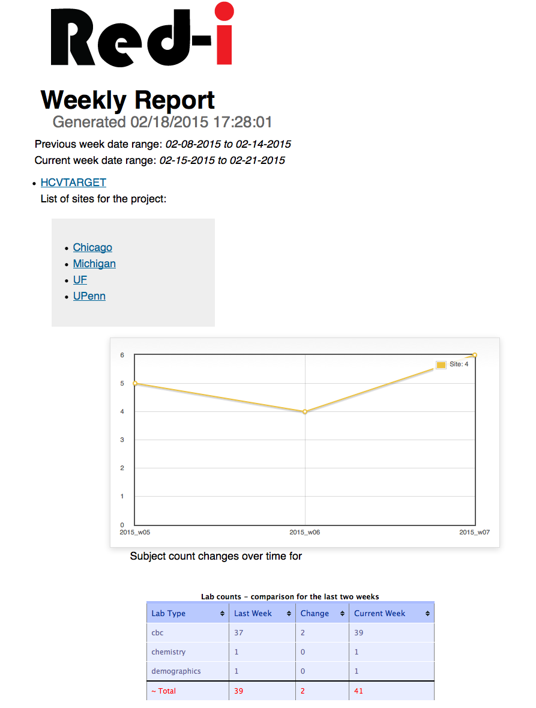

report_generator
================

CTS-IT's software for generating summary reports from RED-I runs.


# Database Schema

To create a fresh SQLite database run:
```
make from_scratch
```


To view the structure of the tables in the SQLite database:

```
make show_schema
```


# Web Application

To test the application run:

```
make run_app
```


# Screenshot


